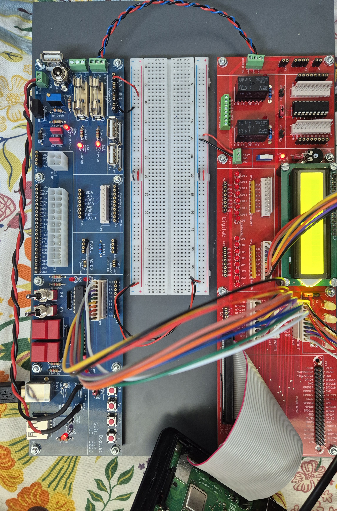

# Umsetzung

Ich habe nicht alle Punkte aus meiner ursprünglichen Planung umsetzen können, da ich es zeitlich leider nicht geschafft habe.

Ein großer Teil der Zeit ging dafür drauf, ein Problem mit dem Raspberry Pi zu beheben. Erst nach etwa zwei Wochen konnte ich mit der eigentlichen Projektarbeit, also dem Spiel, beginnen.

Das Spiel selbst hat keine Levelstruktur. Stattdessen kann der Spieler das Spiel beliebig oft neu starten. Es gibt dabei jeweils nur eine Rückmeldung, ob die Antwort richtig oder falsch war.

Die geplante Verwendung der RGB-LEDs sowie des LCD-Bildschirms konnte ich nicht realisieren. Stattdessen läuft alles über das Dashboard.

# Digilab

Ich habe den Digilab in meinem Projekt benutzt.  
Ich habe vier Schalter und vier LEDs für mein Spiel verwendet.

# Verantwortung

Ich arbeite meist selbstständig und versuche, Probleme zuerst alleine zu lösen. Im Projekt habe ich zum Beispiel das Problem mit dem Raspberry Pi als erstens selbst versucht zu bearbeitet. Aber wenn ich selbst nicht weiter komme, dann gehe ich nach Hilfe fragen.
In der Klasse bin ich hilfsbereit und unterstütze Mitschüler, wenn sie Hilfe brauchen.
Ich arbeite zielstrebig an meinen Aufgaben, auch wenn ich manchmal mehr Zeit brauche.

