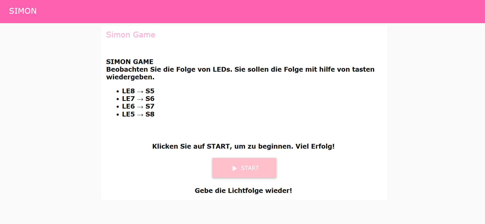
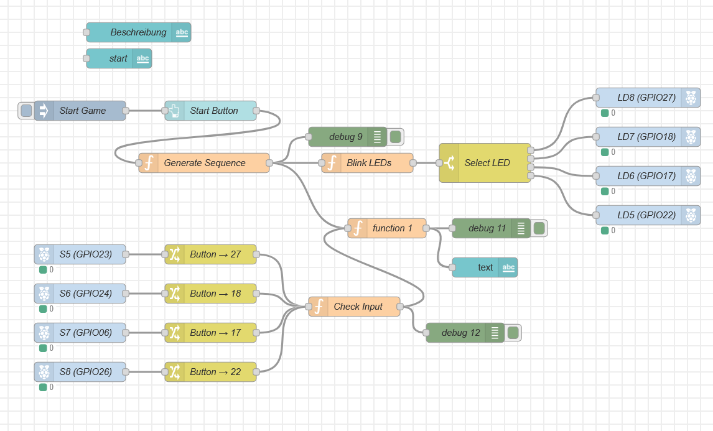

# PROTO2 → Projekt mit Digilab

## Kapitel 1: Beschreibung – *Simon Says* Logik-Puzzle-Spiel

Ein speicherbasiertes Logikspiel, entwickelt mit einem **Raspberry Pi**, **Node-RED** und einem **Digilab** mit LEDs und Tastern.

Dieses Projekt bildet das klassische **„Simon Says“**-Spiel nach, bei dem eine Folge von Lichtern angezeigt wird und der Spieler diese durch das Drücken der Tasten in der richtigen Reihenfolge wiederholen muss. Mit jedem Erfolg wird die Folge länger und schwieriger.

### Funktionen

- Eine Folge von LEDs wird angezeigt.
- Benutzereingabe über Tasten.
- Spiellogik wird in Node-RED umgesetzt.
- Node-RED-Dashboard zur Steuerung und Anzeige des Spielstatus (Start-Knopf).

### Benötigte Hardware

- Raspberry Pi  
- Digilab mit:
  - 4 Taster
  - 4 LEDs
- Jumperkabel

### Verdrahtung

| Komponente | Raspberry Pi GPIO |
|------------|-------------------|
| Taster S5  | GPIO 16           |
| Taster S6  | GPIO 19           |
| Taster S7  | GPIO 20           |
| Taster S8  | GPIO 21           |
| LED 8      | GPIO 12           |
| LED 7      | GPIO 13           |
| LED 6      | GPIO 14           |
| LED 5      | GPIO 15           |

### Spielablauf

1. Das Spiel wird über einen Button im Node-RED-Dashboard gestartet.
2. Eine zufällige Folge von LEDs blinkt.
3. Der Spieler muss die entsprechende Knopf-Folge drücken (S5–S8), die den LEDs LD8–LD5 entspricht.
4. Wenn die Folge korrekt ist:
   - Wird im Dashboard **"Richtig"** angezeigt.
   - Der Spieler kann das Spiel neu starten.
5. Wenn die Folge falsch ist:
   - Wird im Dashboard **"Falsch"** angezeigt.
6. Das Spiel hat keine Levelstruktur – es beginnt immer von vorne.

### Node-RED Dashboard

- Eine kurze Erklärung des Spiels
- **Spiel starten** – Button
- Statusmeldung („Richtig!“ oder „Falsch!“)

---

## Kapitel 2: Umsetzung

Ich habe nicht alle Punkte aus meiner ursprünglichen Planung umsetzen können, da ich es zeitlich leider nicht geschafft habe.

Ein großer Teil der Zeit ging dafür drauf, ein Problem mit dem Raspberry Pi zu beheben. Erst nach etwa zwei Wochen konnte ich mit der eigentlichen Projektarbeit, also dem Spiel, beginnen.

Das Spiel selbst hat keine Levelstruktur. Stattdessen kann der Spieler das Spiel beliebig oft neu starten. Es gibt dabei jeweils nur eine Rückmeldung, ob die Antwort richtig oder falsch war.

Die geplante Verwendung der RGB-LEDs sowie des LCD-Bildschirms konnte ich nicht realisieren. Stattdessen läuft alles über das Dashboard.

---

## Kapitel 3: Digilab

Ich habe den Digilab in meinem Projekt benutzt.  
Ich habe vier Schalter und vier LEDs für mein Spiel verwendet.

---

## Kapitel 4: Verantwortung

Ich arbeite meist selbstständig und versuche, Probleme zuerst alleine zu lösen. Im Projekt habe ich zum Beispiel das Problem mit dem Raspberry Pi zuerst selbst bearbeitet. Wenn ich jedoch nicht weiterkomme, frage ich gezielt nach Hilfe.

In der Klasse bin ich hilfsbereit und unterstütze Mitschüler, wenn sie Hilfe brauchen.  
Ich arbeite zielstrebig an meinen Aufgaben, auch wenn ich manchmal mehr Zeit dafür benötige.
